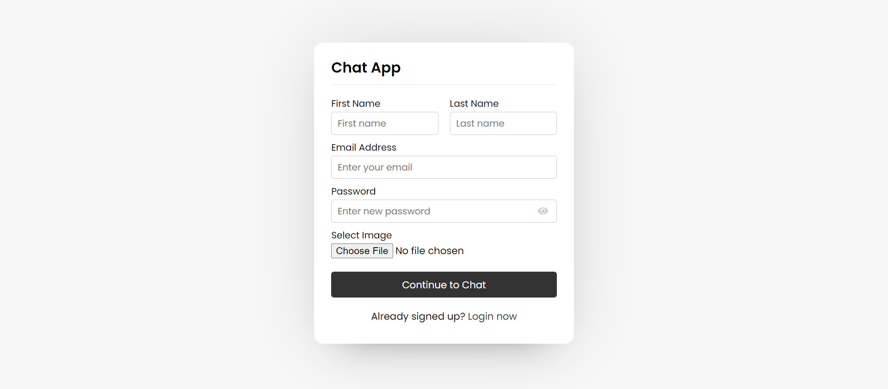
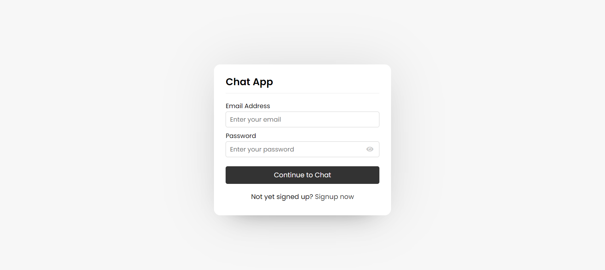
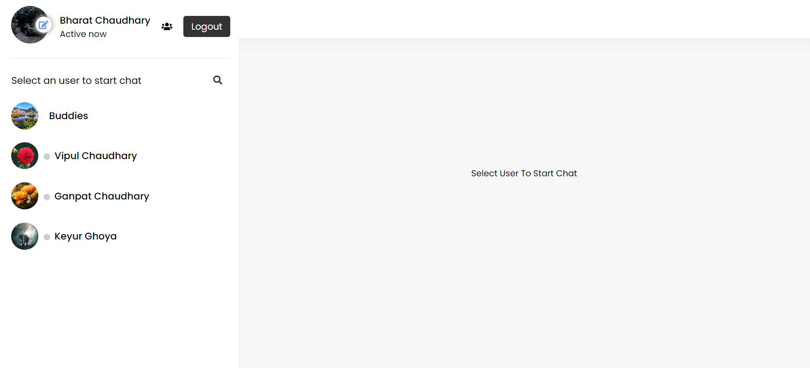
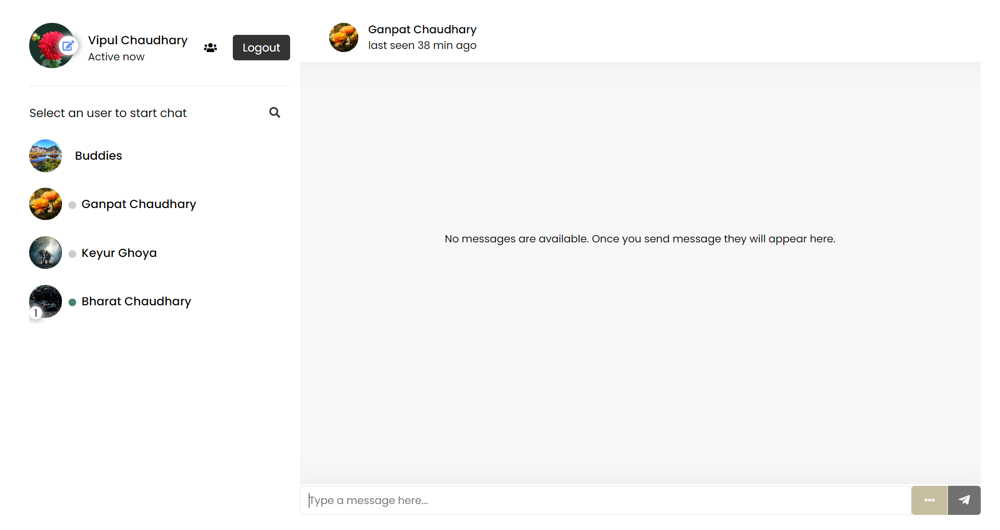
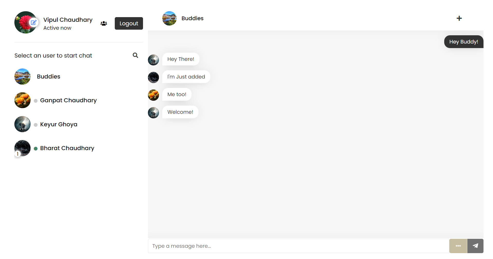
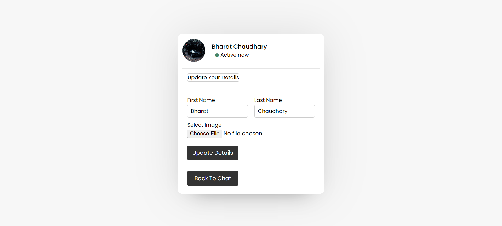
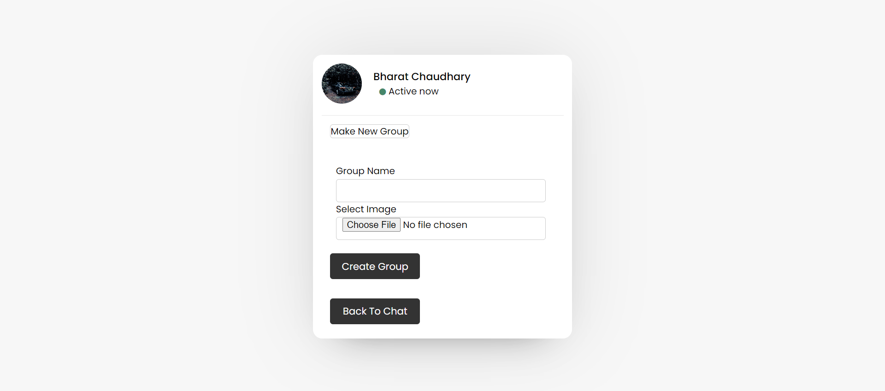

# Web-Chat-App

## Introduction

This is main repo of Web Chat App.

User have to Sign Up first to use this app or if existing user than have to login using his credentials (email and password).

Using this app, users can chat with each other individually.

User can create Group and can add members.

User can update his details on update page.

Image and other files sending also supported.

User can see if other user is active or inactive.

## Clone Repo locally and steps for setup

```sh
git clone https://github.com/Bharat1002/Web_Chat_App.git
cd Web_Chat_App/
```

## Database Connection

import sql file WebChatApp.sql which is included in repo into your MYSQL environment.

Create a file inside php folders as config.php for setting up database connection. paste below code and make changes for your database connection.

```sh
<?php
  $hostname = "localhost"; # hostname from your connection.
  $username = "username";  # username of database user
  $password = "password"; 
  $dbname = "webchatapp";    # database name where you imported WebChatApp.sql file

  $conn = new mysqli($hostname, $username, $password, $dbname);
  if(!$conn){
    echo "Database connection error".$conn -> connect_error();
  }
?>
```

## Some Features of app is attached below to explain more.

### SignUp Page



### Login Page



### Users Page



### Last Seen and Unread Message Page



### Group Chat Page



### Update Details Page



### Make Group Page


